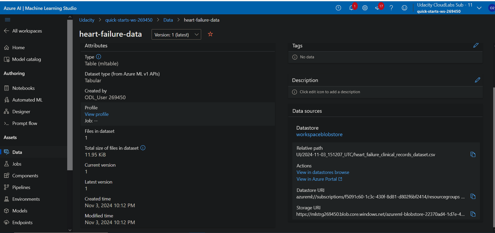
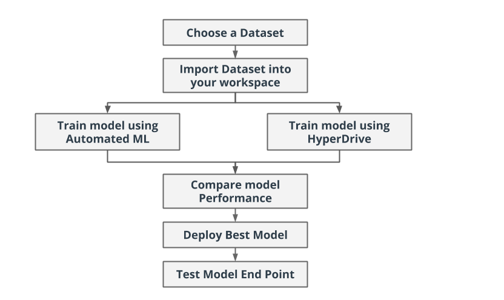
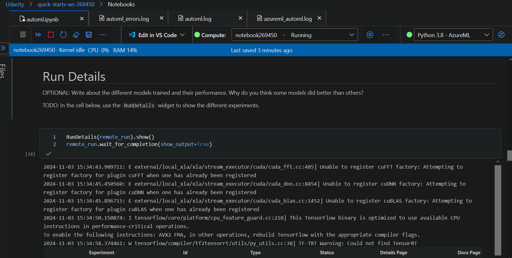
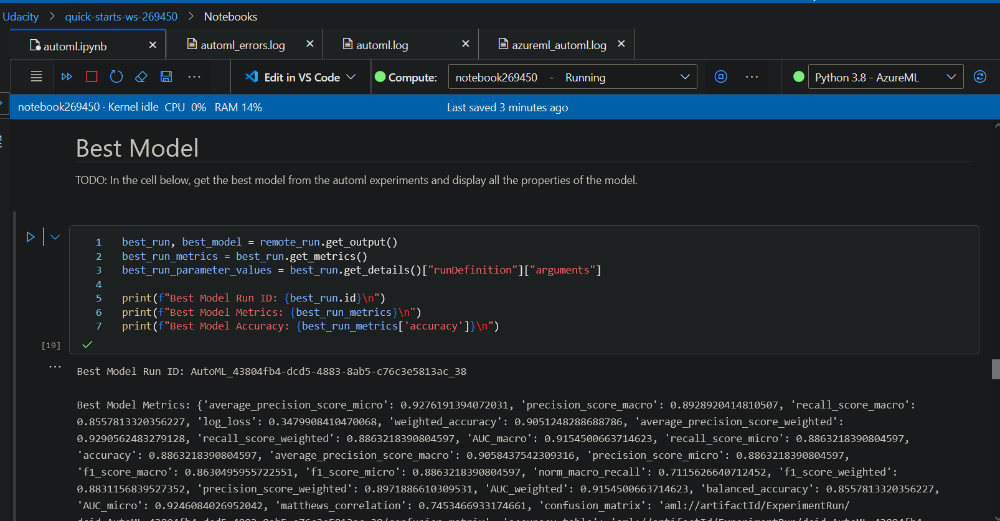
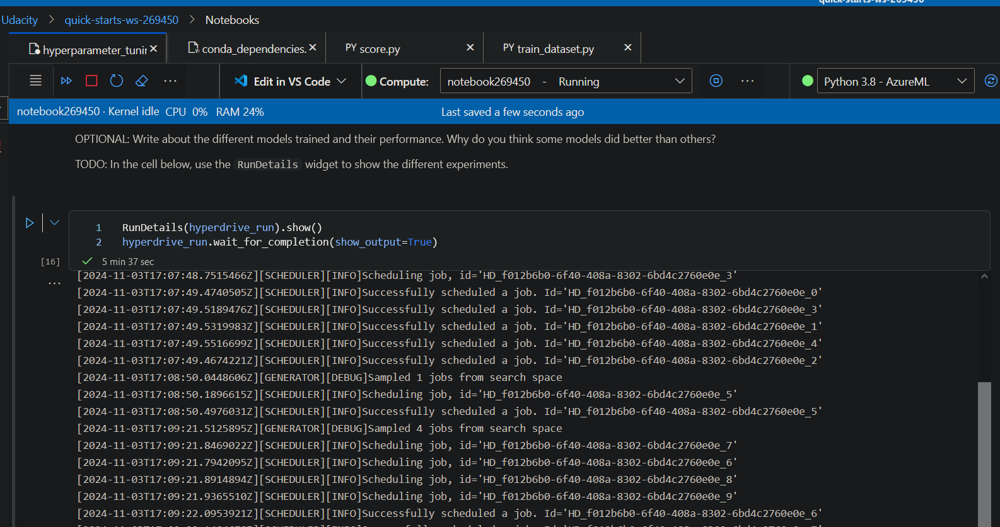
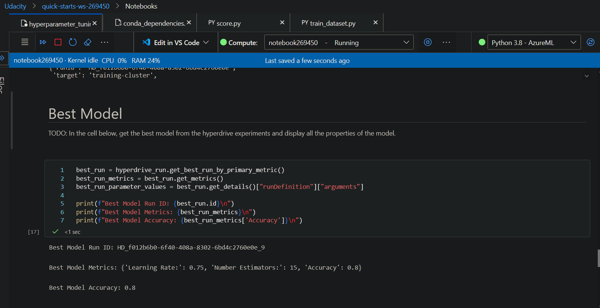
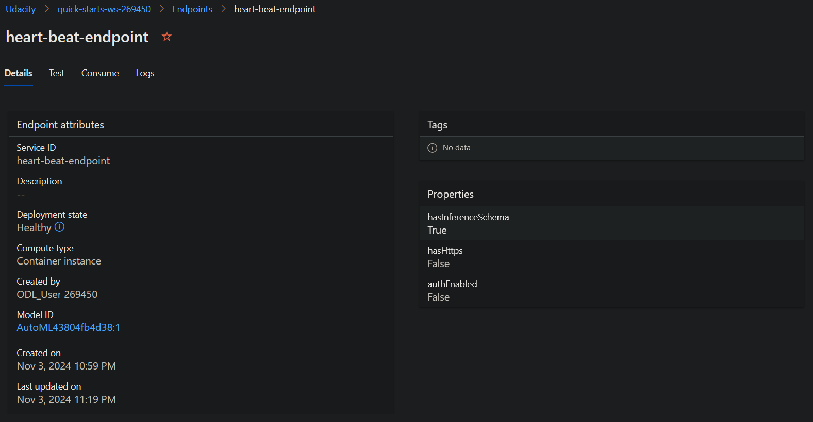

# Heart Failure Prediction

Cardiovascular diseases (CVDs) are the number 1 cause of death globally, taking an estimated 17.9 million lives each year, which accounts for 31% of all deaths worlwide.
Heart failure is a common event caused by CVDs and this dataset contains 12 features that can be used to predict mortality by heart failure.

Most cardiovascular diseases can be prevented by addressing behavioural risk factors such as tobacco use, unhealthy diet and obesity, physical inactivity and harmful use of alcohol using population-wide strategies.

People with cardiovascular disease or who are at high cardiovascular risk (due to the presence of one or more risk factors such as hypertension, diabetes, hyperlipidaemia or already established disease) need early detection and management wherein a machine learning model can be of great help.

## Project Set Up and Installation

- Created new workspace called udacity-capstone
- Created new compute instance (DS-3) to be used by workspace/notebooks
- Forked nd00333-capstone project to my github from Udacity's instance
- Uploaded code from github.com/aspatton/nd00333-capstone repo to my workspace
- Imported all needed dependencies in the notebooks.
- Imported dataset in the workspace (heart_failure_clinical_records_dataset.csv)
- Train model using AutoML
- Train model using HyperDrive
- Compare model performance - AutoML vs HyperDrive
- Select the best performing model via the comparison
- Deploy the best performing model as a web service
- Test the model
- ** Added screenshots throughout the project **
- Editing/updated readme.md

## Dataset
Dataset available at: https://www.kaggle.com/datasets/andrewmvd/heart-failure-clinical-data/data

### Overview
The heart failure dataset includes 13 columns: age, anaemia, creatinine phosphokinase, diabetes, ejection fraction, high blood pressure, platelets, serum creatinine, serum sodium, sex, smoking, time, and DEATH_EVENT. It comprises medical records from 299 patients diagnosed with heart failure.

Project workflow

### Task
The task is to predict the survival of heart failure patients by using the above given features. The first 12 features are used the features(x) to predict the target(y). The 'DEATH_EVENT' column is used as the target variable. This is a binary classification problem where the DEATH_EVENT have values 0 and 1.

0- indicates that the patient survived during the follow-up period 1- indicates that the patient died during the follow-up period

### Access
Download the data manually from Kaggle and proceeded to register it in Azure ML Studio by uploading the CSV file and registering it as an Azure ML dataset.

## Automated ML
Primary Metric ("primary_metric": "accuracy"): This indicates that the main measure used to assess model performance is accuracy. Accuracy measures the ratio of correct predictions to the total predictions made by the model. It's commonly used for classification tasks where the goal is to predict discrete labels.

Experiment Timeout ("experiment_timeout_minutes": 18): This sets a maximum duration for the AutoML experiment to run, which is 15 minutes in this case. If the experiment doesn't complete within this timeframe, it will stop, ensuring efficient use of computational resources and preventing indefinite runs.

Max Concurrent Iterations ("max_concurrent_iterations": 5): This specifies the maximum number of model training iterations that can run simultaneously. By allowing up to 5 iterations concurrently, the experiment can utilize available computational resources effectively, potentially speeding up the overall process.

These adjustments simplify the technical terms while retaining the core meaning and purpose of each parameter in the context of AutoML experimentation for predicting the "DEATH_EVENT" in a dataset.

RunDetails
### Results
Best Model Run ID: HD_f012b6b0-6f40-408a-8302-6bd4c2760e0e_9

Best Model Metrics: {'Learning Rate:': 0.75, 'Number Estimators:': 15, 'Accuracy': 0.8}

Best Model Accuracy: 0.8



Best Model

## Hyperparameter Tuning
Before we train and tune the logistic regression, we split the dataset into 90% for training and 10% for testing. We utilize sklearn's GradientBoostingClassifier Class to establish and fit the model. Thereby, we define a parameter sampler to tune the hyperparameters, specifically the learning rate and number of estimators. Additionally, random parameter sampling was used, because it is an efficient, exploratory, and parallelizable method for hyperparameter tuning, which can potentially find better hyperparameters than other search methods. It is also robust to noise and other sources of variability in the training process. Additionally, a bandit policy was applied, since it is a popular early termination policy used in hyperparameter tuning that aims to save computational resources by terminating poorly performing runs early.

With the estimator, parameter sampler, and an early termination policy, we create a HyperDrive Config, which is subsequently submitted as an experiment. Upon completion of the run, we determine that the best model archives a validation accuracy of 80%.


RunDetails of Hyperparameter Tuning
### Results

Best Model Run ID: HD_f012b6b0-6f40-408a-8302-6bd4c2760e0e_9

Best Model Metrics: {'Learning Rate:': 0.75, 'Number Estimators:': 15, 'Accuracy': 0.8}

Best Model Accuracy: 0.8


Best model with Hyperparameter Tuning
## Model Deployment

Model endpoint
Running to query with sample input
```
python endpoint.py
```

## Screen Recording
[Screencast](https://drive.google.com/file/d/1CpQkAaM6qTb_Rb8G6Xf1XeIxgPmgxWRz/view?usp=sharing)

## Overview of how to improve the project in the future
To a large degree, efforts were made in AutoML to enhance cross-validation and mitigate the effects of imbalanced data. However, these methods were not included in the hyperdrive run.Using SMOTE to address imbalanced data might have improved the AUC score. Random Forest could have been used as an alternative approach.